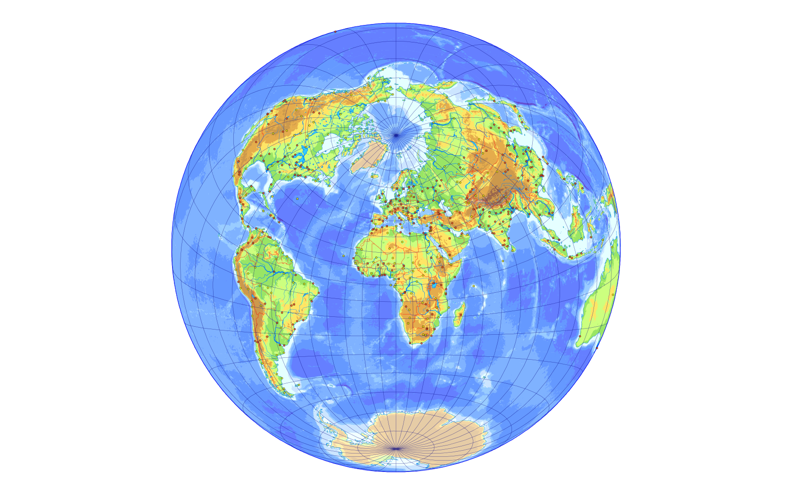
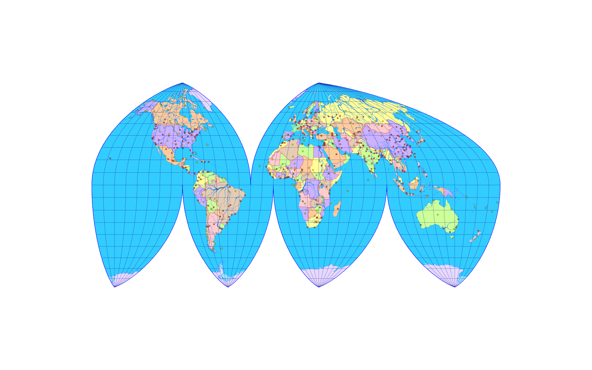
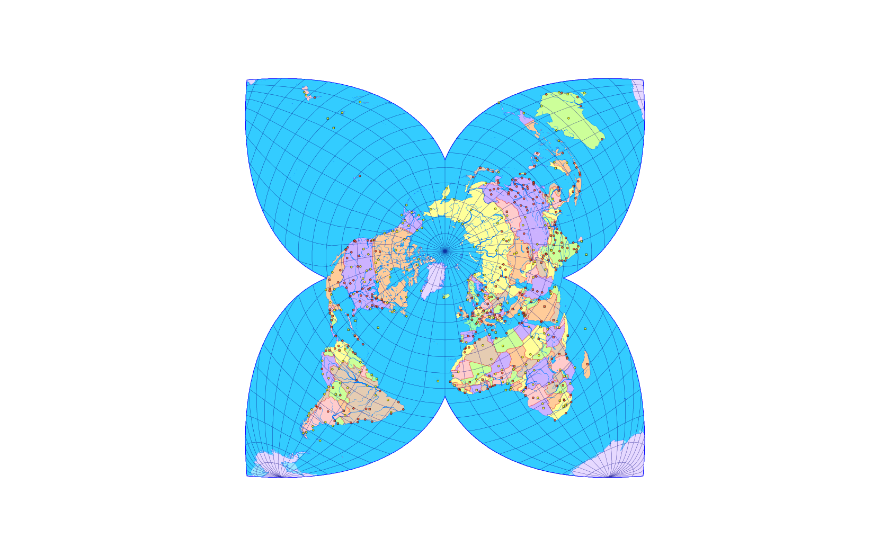

Openlayers3 cut plugin
======================

How it works?
-------------

Read about the problem and the implementation in Kerkovits K: Handling Boundary Cuts while Reprojectig GIS Vector Data ([pages 351–360 in the Proceedings of the 6th ICC&GIS Conference](https://drive.google.com/file/d/0B0iHyURqv8Ncb3RVTFdJMHZEVDQ/view)). Needs Openlayers3 to use it.

API
---

```javascript
ol.proj.rotateProjection(projection, l0, f0, lm, rotName, metaName)
```

Rotates a projection to oblique aspect and registers transform functions between EPSG:4326 and the new projection.

**projection** *ol.proj.ProjectionLike* Original projection.
Transform function between EPSG:4326 and this projection must be defined earlier in either OpenLayers or proj4js.

**l0** *number* Longitude of the metapole. Set to zero if you only want to change the midmeridian.

**f0** *number* Latitude of the metapole. Set to 90 if you only want to change the midmeridian.

**lm** *number* Metalongitude of the midmeridian.

**rotName** *string* SRS of the new, rotated projection. (May be any arbitrary name.)

**metaName** *string* SRS of the created metagraticule. (May be any arbitrary name.)

**_return_** *ol.proj.Projection* Object for the rotated projection.

```javascript
(new ol.format.Feature()).readCutFeatures(source, opt_options, opt_metaName, opt_azimuthal, opt_cutLines)
```
Acts as readFeature() but cuts features at antimeridian and optional other arbitary lines.

**source** *Document|Node|Object|string* Source.

**opt_options** *olx.format.ReadOptions*  Read options. See Openlayers documentation.

**opt_metaName** *ol.proj.ProjectionLike|undefined*  SRS of the metagraticule created with ol.proj.rotateProjection.
Required when the destination projection is in oblique aspect or the midmeridian is not Greenwich. Default EPSG:4326.
If used, please set featureProjection in the read options to the projection created with ol.proj.rotateProjection.

**opt_azimuthal** *boolean|undefined*  If true, cut will not preform at the antimeridian, only at the antipode.
Default is false. Only set true for azimuthal projections (eg. Lambert Azimuthal or Berghaus star).

**opt_cutLines** *Array.\<ol.cut.CutLine\>|undefined*  If the projection has additional boundary cuts following any metagraticule line
(eg. Goode or Berghaus), specify them here. Antimeridian and pole line cuts are automatic, must not be included. Default: empty array. Further information below.

**_return_** *Array.\<ol.Feature\>* Features.

```javascript
ol.cut.cutLine
```

Is always an object with the following properties:

**type** *string* Can be either 'parallel' or 'meridian'.

**deg** *number* The metargraticule line to be cut

**from** *number*

**to** *number* The affected interval. From must be less than to.


Examples
--------

Direct aspects in these examples were created using the ol.proj.addCoordinateTransforms method. See Openlayers documentation.
Following code only shows commands related to this plugin.

###Simple rotation

```javascript
var src = new ol.source.Vector();
var rotatedWagner9 = ol.proj.rotateProjection('wagner9', 125, 65, 90, 'wagner9rot', 'meta1');
src.addFeatures((new ol.format.GeoJSON()).readCutFeatures(json, {
	dataProjection: 'EPSG:4326',
	featureProjection: 'wagner9rot'
}, 'meta1'));
```


### Twilight-projection

```javascript
var src = new ol.source.Vector();
var rotAzim = ol.proj.rotateProjection('vertperspective', 10, 23.5, 0, 'twilight', 'meta2');
src.addFeatures((new ol.format.GeoJSON()).readCutFeatures(json, {
	dataProjection: 'EPSG:4326',
	featureProjection: 'twilight'
}, 'meta2', true, [
	{type: 'parallel', deg: -45.58469140280703, from: -180, to: 180}
]));
```



### Interrupted projection with antimeridian <> 180°

```javascript
var src = new ol.source.Vector();
var boggsMidmeridian = ol.proj.rotateProjection('boggs', 0, 90, 10, 'boggsalt', 'meta3');
src.addFeatures((new ol.format.GeoJSON()).readCutFeatures(json, {
	dataProjection: 'EPSG:4326',
	featureProjection: 'boggsalt'
}, 'meta3', false, [
	{type: 'meridian', deg: -40, from: 0, to: 90},
	{type: 'meridian', deg: -100, from: -90, to: 0},
	{type: 'meridian', deg: -20, from: -90, to: 0},
	{type: 'meridian', deg: 80, from: -90, to: 0}
]));
```



### Star-shaped projection

```javascript
var src = new ol.source.Vector();
var rotatedOlsson = ol.proj.rotateProjection('williamolsson', -20, 75, 0, 'olssonrot', 'meta4');
src.addFeatures((new ol.format.GeoJSON()).readCutFeatures(json, {
	dataProjection: 'EPSG:4326',
	featureProjection: 'olssonrot'
}, 'meta4', true, [
	{type: 'meridian', deg: 180, from: -90, to: 20},
	{type: 'meridian', deg: -90, from: -90, to: 20},
	{type: 'meridian', deg: 0, from: -90, to: 20},
	{type: 'meridian', deg: 90, from: -90, to: 20}
]));
```


